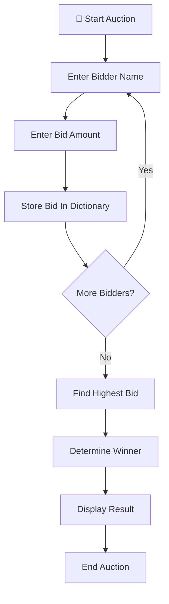

# 🔨 Secret Auction Program (Python)


A simple and interactive **Secret Auction Simulator** built using Python.

This project allows multiple participants to place confidential bids, stores all bids using Python dictionaries, and automatically determines the highest bidder at the end of the auction.

The project demonstrates **dictionaries, functions, loops, conditional logic, user input handling, and winner selection algorithms** through a real-world auction system.

---

# 📌 Table of Contents

* 🚀 Features
* 🔨 What is a Secret Auction?
* 🧠 Auction Workflow
* 📊 Bidding System
* 🛠️ Tech Stack
* ▶️ How to Run
* 📸 Example Session
* 🎯 Learning Outcomes
* 🔮 Future Improvements
* 🤝 Contributing
* 📜 License
* 👨‍💻 Author
* ⭐ Support

---

# 🚀 Features

| Feature                  | Description                        |
| ------------------------ | ---------------------------------- |
| 👥 Multiple Participants | Supports unlimited bidders         |
| 💰 Bid Collection        | Collects bids securely             |
| 📋 Dictionary Storage    | Stores bidder names and bids       |
| 🏆 Winner Detection      | Automatically finds highest bidder |
| 🔄 Continuous Bidding    | Accepts bids until auction ends    |
| ⚡ Instant Results        | Displays winner immediately        |
| ⌨️ CLI Interaction       | Fully terminal-based application   |

---

# 🔨 What is a Secret Auction?

A Secret Auction is a bidding process where participants submit their bids privately.

The bidders do not know the bids of other participants.

Once all bids are submitted:

* 📋 All bids are collected
* 🔍 The highest bid is identified
* 🏆 The winner is announced

---

# 📊 Bidding System

Each participant submits:

| Input         | Description             |
| ------------- | ----------------------- |
| 👤 Name       | Bidder's name           |
| 💰 Bid Amount | Amount they want to bid |

Example:

| Bidder | Bid  |
| ------ | ---- |
| Prem   | $300 |
| Rahul  | $500 |
| Aman   | $450 |

Result:

```text
Winner: Rahul
Winning Bid: $500
```

---

# 🧠 Auction Workflow



---

# 🛠️ Tech Stack

<table>
<thead>
<tr>
<th>⚙️ Technology</th>
<th>💡 Purpose</th>
</tr>
</thead>

<tbody>

<tr>
<td><strong>🐍 Python 3</strong></td>
<td>Main programming language</td>
</tr>

<tr>
<td><strong>📋 Dictionaries</strong></td>
<td>Store bidder names and bid values</td>
</tr>

<tr>
<td><strong>🧩 Functions</strong></td>
<td>Organize auction logic</td>
</tr>

<tr>
<td><strong>🔁 Loops</strong></td>
<td>Handle multiple bidders</td>
</tr>

<tr>
<td><strong>🔀 Conditional Logic</strong></td>
<td>Determine auction flow</td>
</tr>

<tr>
<td><strong>⌨️ User Input</strong></td>
<td>Collect participant information</td>
</tr>

</tbody>
</table>

---

# ▶️ How to Run

<table>
<thead>
<tr>
<th>🚀 Step</th>
<th>💻 Command</th>
<th>📌 Description</th>
</tr>
</thead>

<tbody>

<tr>
<td><strong>1️⃣ Clone Repository</strong></td>
<td><code>git clone https://github.com/your-username/secret-auction.git</code></td>
<td>Download the project</td>
</tr>

<tr>
<td><strong>2️⃣ Open Folder</strong></td>
<td><code>cd secret-auction</code></td>
<td>Navigate to project directory</td>
</tr>

<tr>
<td><strong>3️⃣ Run Program</strong></td>
<td><code>secret_auction.py</code></td>
<td>Launch the auction simulator</td>
</tr>

</tbody>
</table>

---

# 📸 Example Session

```text
What is your name: Prem

What is your bid $: 300

Are there any other bidders? Type yes or no: yes

------------------------------------------------

What is your name: Rahul

What is your bid $: 500

Are there any other bidders? Type yes or no: no

The winner of this auction is Rahul with highest bid of $ 500
```

---

# 🏆 Winner Selection Logic

The program automatically scans all submitted bids.

Example Dictionary:

```python
{
    "Prem": 300,
    "Rahul": 500,
    "Aman": 450
}
```

The algorithm:

1. Starts with the current highest bid.
2. Loops through all bidders.
3. Compares bid values.
4. Updates the highest bidder whenever a larger bid is found.
5. Announces the winner.

---

# 🎯 Learning Outcomes

<table>
<thead>
<tr>
<th>📚 Concept</th>
<th>💡 What I Learned</th>
</tr>
</thead>

<tbody>

<tr>
<td><strong>📋 Dictionaries</strong></td>
<td>Storing and accessing key-value pairs</td>
</tr>

<tr>
<td><strong>🧩 Functions</strong></td>
<td>Writing reusable code blocks</td>
</tr>

<tr>
<td><strong>🔁 Loops</strong></td>
<td>Processing multiple bidders efficiently</td>
</tr>

<tr>
<td><strong>🔀 Conditional Logic</strong></td>
<td>Controlling auction flow</td>
</tr>

<tr>
<td><strong>⌨️ User Input</strong></td>
<td>Building interactive programs</td>
</tr>

<tr>
<td><strong>🧠 Problem Solving</strong></td>
<td>Designing algorithms to determine winners</td>
</tr>

</tbody>
</table>

💡 *This project strengthened my understanding of dictionaries, loops, functions, and real-world decision-making algorithms.*

---

# 🔮 Future Improvements

* 💵 Support multiple auction rounds
* 📂 Save auction history to files
* 🏷️ Auction items and descriptions
* 👥 User authentication
* 📊 Auction statistics dashboard
* 🖥️ Graphical User Interface (GUI)
* 🌐 Web-based auction platform

---

# 🤝 Contributing

Contributions are always welcome!

Whether you're learning Python or looking to improve the auction system, feel free to contribute.

### Steps To Contribute

* Fork this repository
* Create a new branch
* Implement improvements
* Commit your changes
* Submit a Pull Request

Let's build and learn together 🚀

---

# 📜 License

<div align="center">

### 🛡️ MIT License

This project is licensed under the MIT License.

</div>

---

### 🔓 What This Means

* ✅ Use the project freely
* ✅ Modify the source code
* ✅ Share your own versions
* ✅ Use commercially

Just provide proper attribution.

---

# 👨‍💻 Author

<div align="center">

## Prem Kumar

🎓 B.Tech Computer Science Engineering Student

💡 Passionate about Programming, Development, Problem Solving, and Building Real-World Projects.

</div>

---

### 🌟 About Me

* 🎓 Computer Science Student
* 🐍 Learning Python and Software Development
* 🚀 Building projects to improve problem-solving skills
* 💡 Exploring technology through practical applications

> *"Keep building. Keep learning. Keep going beyond."*

---

# ⭐ Support

<div align="center">

### 💙 Show Your Support

If you found this project helpful or interesting, consider supporting it.

</div>

---

### 🚀 Ways To Support

* ⭐ Star this repository
* 🍴 Fork the project
* 🛠️ Contribute improvements
* 📢 Share it with other learners

---

✨ Every star motivates me to keep building, learning, and sharing more projects with the community.

